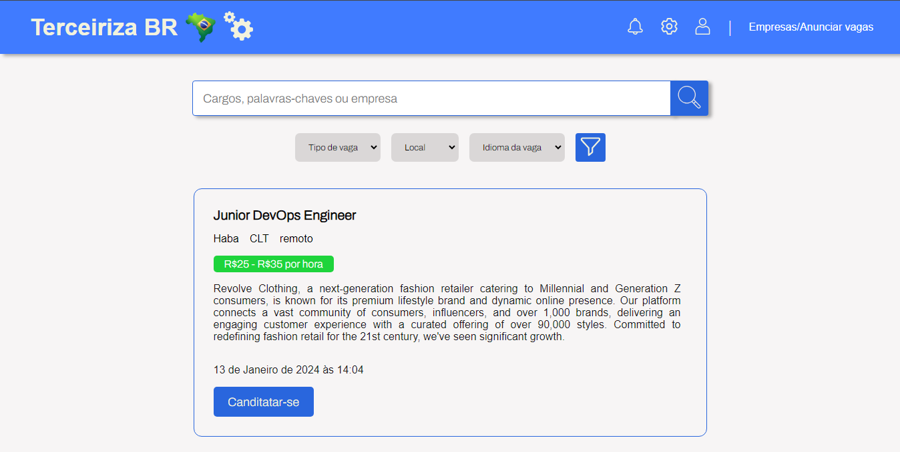

<h1>Terceiriza BR</h1>

<h2>Bem vindo(ao) meu repositório</h2>

>Status do projeto: Em Desenvolvimento

## Descrição do projeto
 

Terceiriza BR é uma plataforma que eu estou participando do desenvolvimento em uma Startup que tem como objetivo fazer um match entre empresas e candidatos, nessa plataforma é possivel que empresas cadastrem suas vagas e que os candidatos cadastrem seu CV. Além disso a plataforma conta com um sistema de busca avançado que busca por: Cargos, Palavras-chaves, empresas. Também conta com sistema de filtro para que a busca seja mais especifica.

 
## Funcionalidades

:heavy_check_mark: `Funcionalidade 1:` Cadastro na plataforma

:heavy_check_mark: `Funcionalidade 2:`  Login na plataforma

:heavy_check_mark: `Funcionalidade 3:` buscar por empregos

:heavy_check_mark: `Funcionalidade 4:` filtrar a busca do emprego desejado

:heavy_check_mark: `Funcionalidade 5:` Candidatar-se em vagas de empregos desejadas

:heavy_check_mark: `Funcionalidade 5:` Anunciar vagas de empregos para obter os melhores candidatos

        
<video width="420" height="340" controls="controls">
    <source src="./filme.mp4" type="video/mp4">
</video>
 

    <h1>Aplicação<h1>
      
      
      
   <a href="">Acessar</a>

            
## Ferramentas utilizadas

 

   
### Você também me encontra em:
&nbsp;&nbsp;
&nbsp;&nbsp;
 
<h2>Guia</h2>

